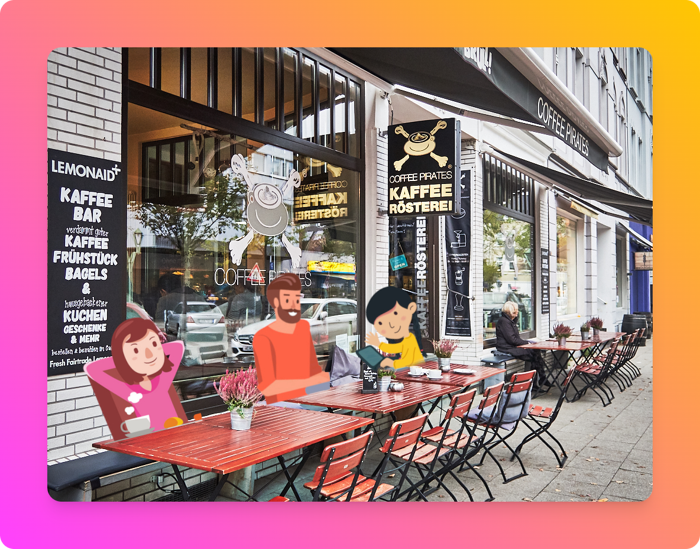

# 🪐 Beam
Beam is a simple web meeting app using [WebRTC](https://webrtc.org/) to have virtual chats in delightful locations. The source code is very hacky, cobbled together during Covid lockdowns from different WebRTC and TensorFlow.js tutorials (links lost, to be updated).

Try it out for yourself at 🪐 https://beam.ianua.app. No registration is required, and it runs well in [Chromium-based](https://alternativeto.net/category/browsers/chromium-based/) browsers (others not yet tested).

Locations currently supported:
- Berlin café
- California taqueria
- Havana wedding car
- Roller coaster
- Vienna Prater
- London bus

Ideas for features or new locations? Create an issue and let's do it!

## Build
Prerequisites:
- Node.js

To build it yourself, you can run the `build.sh` script in the **service** directory. This builds the client and copies it to the service public directory. You can run the service with `npm start` to test locally, or the `deploy.sh` contains a sample deployment to a Google Cloud VM using a docker image.

## Atributions

- <a href="https://freesound.org/people/alexkandrell/sounds/316095/">Street_London_Traffic_People_busy_eq.wav</a> by <a href="https://freesound.org/people/alexkandrell/">alexkandrell</a> | License: <a href="http://creativecommons.org/licenses/by/3.0/">Attribution 3.0</a>
- <a href="https://freesound.org/people/Garuda1982/sounds/535910/">roller coaster field recording</a> by <a href="https://freesound.org/people/Garuda1982/">Garuda1982</a> | License: <a href="http://creativecommons.org/publicdomain/zero/1.0/">Creative Commons 0</a>
- Door Photo by <a href="https://unsplash.com/@tuninglever?utm_content=creditCopyText&utm_medium=referral&utm_source=unsplash">Alfred Leung</a> on <a href="https://unsplash.com/photos/white-wooden-door-open-Dw3GO4fUf5Y?utm_content=creditCopyText&utm_medium=referral&utm_source=unsplash">Unsplash</a>
      
      